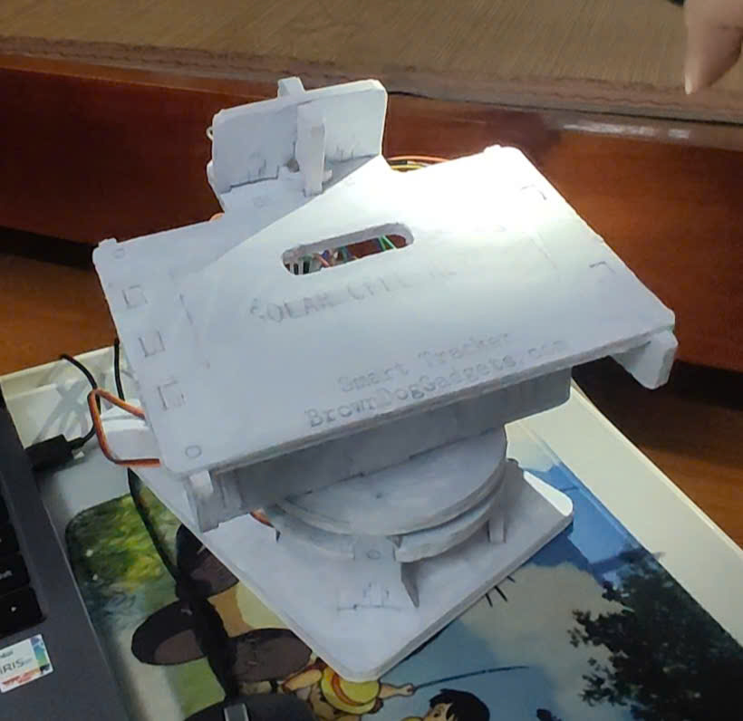
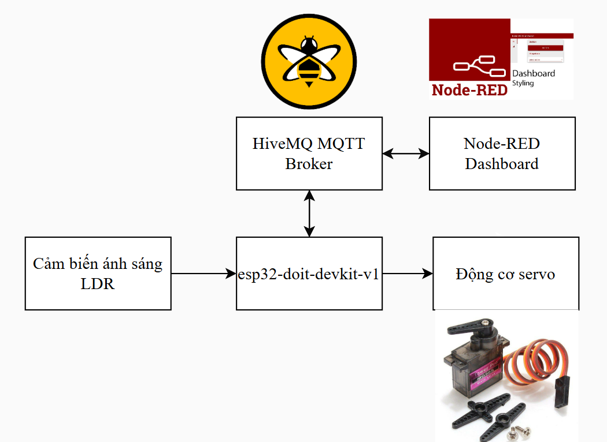
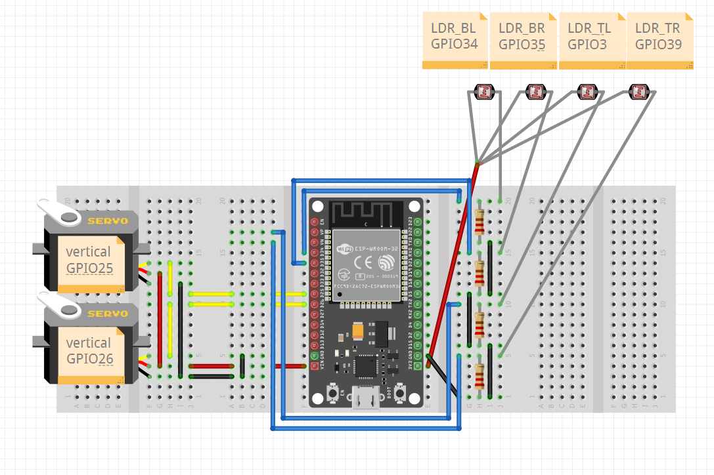
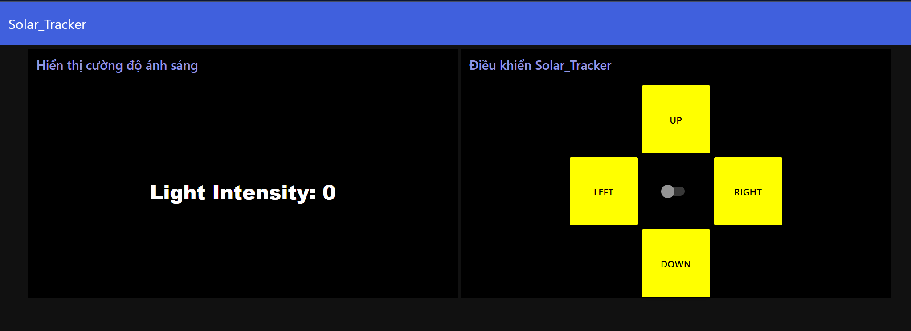
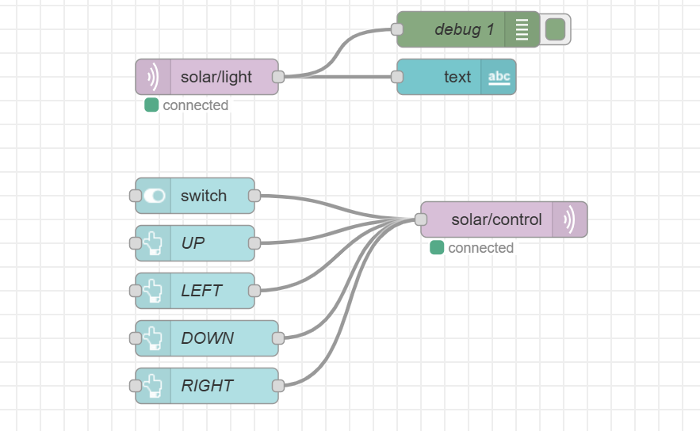

# Simple Dual-Axis Solar Tracker

# Đề Tài: Mô Hình Bộ Điều Hướng Pin Mặt Trời

## 1. Đặt vấn đề

Hiện nay, trong bối cảnh nhu cầu sử dụng năng lượng ngày càng tăng cao, việc khai thác và sử dụng các nguồn năng lượng tái tạo đang trở thành xu hướng tất yếu. Pin mặt trời, một trong những giải pháp năng lượng sạch và bền vững, đã được ứng dụng rộng rãi. Tuy nhiên, hiệu suất chuyển đổi của các tấm pin mặt trời phổ biến chỉ đạt 18-20%, tức là chỉ tận dụng được một phần nhỏ lượng ánh sáng mặt trời nhận được. Điều này đặt ra thách thức lớn trong việc tối ưu hóa và khai thác tối đa tiềm năng của năng lượng mặt trời.

Một giải pháp mang tính khả thi là cải thiện hiệu quả sử dụng ánh sáng mặt trời bằng cách điều chỉnh các tấm pin theo hướng mặt trời, tương tự như cách hoa hướng dương luôn hướng về nguồn sáng. Thực tế cho thấy, các hệ thống pin mặt trời có cơ chế theo dõi hướng mặt trời (solar tracker) có thể tăng sản lượng năng lượng lên đến 30% so với các tấm pin cố định.

Dự án "Simple Dual-Axis Solar Tracker" ra đời nhằm đáp ứng nhu cầu cấp thiết này, với mục tiêu không chỉ tăng hiệu suất năng lượng mà còn mang lại sự linh hoạt và tiện lợi trong sử dụng. Hệ thống này được xây dựng trên nền tảng vi điều khiển ESP32, sử dụng các cảm biến ánh sáng (LDR), và giao thức MQTT để điều khiển từ xa thông qua giao diện trực quan Node-RED Dashboard. Bên cạnh chế độ tự động, hệ thống còn hỗ trợ chế độ điều khiển thủ công, mở ra hướng tiếp cận linh hoạt và hiệu quả hơn cho người dùng trong việc khai thác năng lượng mặt trời.

---

## 2. Cấu tạo

**Hình ảnh thực tế:**

Hệ thống theo dõi mặt trời được cấu tạo bởi:

- **ESP32 DOIT Devkit V1**: Bộ điều khiển chính, có nhiệm vụ xử lý tín hiệu và điều khiển động cơ.
- **Cảm biến LDR (Light Dependent Resistor)**: Để đo cường độ ánh sáng từ các hướng khác nhau.
- **Động cơ Servo**:
  - 1 động cơ servo chuyển động ngang (horizontal).
  - 1 động cơ servo chuyển động dọc (vertical).

---

## 3. Nguyên lý hoạt động

Hệ thống hoạt động dựa trên sự chênh lệch cường độ ánh sáng nhận được từ các cảm biến LDR. Tín hiệu từ các cảm biến được gửi đến ESP32 để xử lý. Dựa vào sự chênh lệch ánh sáng:

- **Chế độ tự động**:
  - Động cơ servo sẽ xoay để tấm pin mặt trời hướng đến nơi có ánh sáng mạnh nhất.
- **Chế độ thủ công**:
  - Người dùng có thể điều khiển động cơ thông qua giao diện Node-RED Dashboard để điều chỉnh tấm pin theo ý muốn.

---

## Tính năng
- **Chế độ tự động**: Điều chỉnh vị trí tấm pin dựa trên cường độ ánh sáng được phát hiện bởi cảm biến LDR.
- **Chế độ thủ công**: Cho phép điều khiển động cơ ngang và dọc thông qua Node-RED Dashboard.
- **Tích hợp MQTT**: Giao tiếp với HiveMQ để gửi dữ liệu cường độ ánh sáng và nhận lệnh điều khiển.
- **Node-RED Dashboard**: Cung cấp giao diện tương tác để chuyển đổi chế độ và điều khiển động cơ.

---

## Thành phần
- **Phần cứng**:
  - ESP32
  - 4 x Cảm biến ánh sáng (LDR)
  - 2 x Động cơ Servo (SG90 hoặc tương đương)
  - Điện trở (10kΩ) cho mạch LDR
  - Nguồn cấp (5V, khuyến nghị 2A cho động cơ servo)
- **Phần mềm**:
  - PlatformIO
  - Node-RED với MQTT broker: HiveMQ

---

**Sơ đồ khối:**

**Sơ đồ kết nối phần cứng:**

**Giao diện Dashboard:**

---

### 3. **Chế độ điều khiển**
- **Chế độ tự động**:
  - Điều chỉnh góc servo tự động dựa trên giá trị LDR.
- **Chế độ thủ công**:
  - Sử dụng các nút trên Node-RED để điều khiển servo thủ công.
  - Nút BẬT/TẮT chế độ thủ công nằm ở chính giữa.
  - Các nút điều hướng gồm UP, DOWN, RIGHT, LEFT.

    
**Luồng Node-RED:**

---

## MQTT Topics
- **Publish**:
  - `solar/light`: Gửi dữ liệu cường độ ánh sáng.
- **Subscribe**:
  - `solar/control`: Nhận lệnh điều khiển.

#### Lệnh ví dụ:
- `AUTO_ON`: Bật chế độ tự động.
- `AUTO_OFF`: Tắt chế độ tự động.
- `MANUAL_HORIZONTAL:UP`: Di chuyển động cơ ngang sang phải.
- `MANUAL_HORIZONTAL:DOWN`: Di chuyển động cơ ngang sang trái.
- `MANUAL_VERTICAL:UP`: Di chuyển động cơ dọc lên.
- `MANUAL_VERTICAL:DOWN`: Di chuyển động cơ dọc xuống.

---

## Kiểm thử
**Video kiểm thử hệ thống:**
[Link Video](videos/kiemthu.mp4)

---

## Hướng phát triển

Dưới đây là một số hướng phát triển tiềm năng cho dự án:

1. **Tích hợp pin mặt trời và pin lưu trữ**:
   - Lắp thêm pin mặt trời để thu năng lượng thực tế.
   - Sử dụng pin Li-ion để lưu trữ năng lượng, cung cấp điện cho hệ thống khi không có ánh sáng mặt trời.

2. **Tối ưu hóa thuật toán điều hướng**:
   - Sử dụng các thuật toán nâng cao như PID để cải thiện độ chính xác của hệ thống.

3. **Tích hợp cảm biến bổ sung**:
   - Cảm biến nhiệt độ và độ ẩm để theo dõi môi trường.
   - Cảm biến gió để bảo vệ tấm pin khỏi hư hỏng trong điều kiện thời tiết khắc nghiệt.
