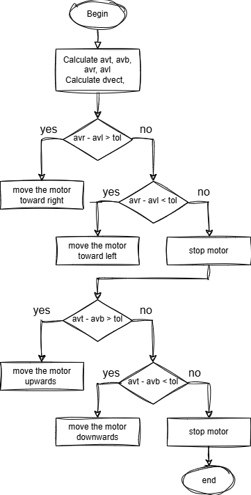
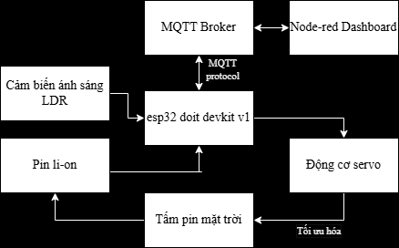

# Simple-Dual-Axis-Solar-Tracker
# **Đề Tài: Mô Hình Bộ Điều Hướng Pin Mặt Trời**

## **1. Đặt vấn đề**
Đối với hầu hết các trường hợp, các tấm pin mặt trời phổ biến hàng ngày của chúng ta chạy với hiệu suất **18-20%**, nghĩa là chúng chỉ chuyển đổi 18-20% lượng ánh sáng mặt trời nhận được thành điện năng.  

Bài toán đặt ra là chúng ta cần **cải thiện hiệu quả của các tấm pin** hoặc tìm cách **nhận được nhiều ánh sáng hơn** .  

Cách đơn giản nhất để tối ưu hóa năng lượng là điều chỉnh **tấm pin hướng về mặt trời** giống như cách hoa hướng dương hoạt động.  

Trên thực tế, các tấm pin mặt trời có cơ chế **theo dõi mặt trời** tạo ra **nhiều hơn khoảng 30% năng lượng** mỗi ngày so với tấm pin cố định.

---

## **2. Cấu tạo**
Hệ thống theo dõi mặt trời được cấu tạo bởi:
- **Esp32 DOIT Devkit V1**: Bộ điều khiển chính, có nhiệm vụ xử lý tín hiệu và điều khiển động cơ.
- **Cảm biến LDR (Light Dependent Resistor)**: Để đo cường độ ánh sáng từ các hướng khác nhau.
- **Động cơ servo**:
  - 1 động cơ servo chuyển động **ngang** (theo trục azimuth).
  - 1 động cơ servo chuyển động **dọc** (theo trục elevation).

---

## **3. Nguyên lý hoạt động**
Dưới đây là mô tả nguyên lý hoạt động của hệ thống:
1. **Cảm biến ánh sáng (LDR)**:
   - Gồm 4 cảm biến được đặt ở các góc khác nhau của tấm pin (trên-trái, trên-phải, dưới-trái, dưới-phải).
   - Mỗi cảm biến đo cường độ ánh sáng tại vị trí của nó.

2. **Vi điều khiển (ESP32)**:
   - Thu thập dữ liệu từ các cảm biến LDR.
   - So sánh giá trị ánh sáng từ các cặp cảm biến để xác định hướng có ánh sáng mạnh nhất.
   - Nếu phát hiện sự chênh lệch ánh sáng đủ lớn, nó sẽ điều chỉnh góc của các động cơ servo để tối ưu hướng tấm pin mặt trời.

Hình 1
     
     
Hình 2
     

---

